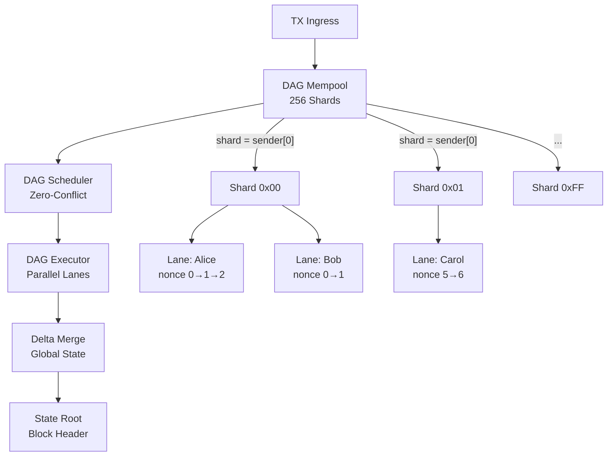

# DAG Mempool — Implementation Walkthrough

## Architecture Overview



## Key Design Decision

Zephyria's isolated account model means **every TX's write-set is unique to its sender**. This eliminates cross-sender conflicts entirely, simplifying the DAG to per-sender nonce chains. The result: lanes execute with **zero coordination**.

## Files Changed

### New Files (3)

| File | Lines | Purpose |
|------|-------|---------|
| [dag_mempool.zig](file:///Users/karan/Zephyria/src/core/dag_mempool.zig) | ~1000 | 256-shard mempool with per-sender lanes, bloom filter, rate limiting, hot-shard protection, orphan GC |
| [dag_scheduler.zig](file:///Users/karan/Zephyria/src/core/dag_scheduler.zig) | ~410 | Zero-conflict scheduler: O(n log n) priority sort, gas-balanced thread assignment, DAG root computation |
| [dag_executor.zig](file:///Users/karan/Zephyria/src/core/dag_executor.zig) | ~610 | 3-phase pipeline: parallel lane execution → delta merge → state root. Replaces executor.zig + turbo_executor.zig |

### Modified Files (7)

| File | Change |
|------|--------|
| [block_producer.zig](file:///Users/karan/Zephyria/src/core/block_producer.zig) | Dual pipeline: DAG (primary) + legacy (fallback). `BuildResult` includes `lane_count` + `dag_root` |
| [mod.zig](file:///Users/karan/Zephyria/src/core/mod.zig) | Registered `dag_mempool`, `dag_scheduler`, `dag_executor` |
| [zelius.zig](file:///Users/karan/Zephyria/src/consensus/zelius.zig) | Added `validateBlockDAG()` — nonce contiguity + cross-lane independence verification |
| [pipeline.zig](file:///Users/karan/Zephyria/src/consensus/pipeline.zig) | Added `dag_root` field to `Proposal` |
| [security.zig](file:///Users/karan/Zephyria/src/core/security.zig) | Added `DAGSecurityConfig` — lane depth, hot-shard, nonce gap, orphan timeout params |
| [gulf_stream.zig](file:///Users/karan/Zephyria/src/p2p/gulf_stream.zig) | Added `shard_hints` to `ForwardBatch` for DAG routing |
| [build.zig](file:///Users/karan/Zephyria/build.zig) | Added DAG test target |

### Test File (1)

| File | Tests |
|------|-------|
| [dag_mempool_test.zig](file:///Users/karan/Zephyria/src/core/dag_mempool_test.zig) | 15 tests: vertex write-keys, lane nonce ordering, replacement gas bump, shard assignment, scheduler plan generation, DAG root determinism, gas-balanced threading, security config |

## Security Measures

| Attack Vector | Protection |
|---------------|------------|
| Lane depth bomb | `max_txs_per_lane = 256` |
| Hot-shard attack | Auto gas premium when shard load > 2× mean |
| Nonce gap reservation | `max_nonce_gap = 64` |
| Orphan lane memory exhaustion | GC after 60s inactivity |
| Bloom filter saturation | Reset every 1000 blocks |
| Cross-lane conflict injection | Defense-in-depth verification in `validateBlockDAG` |

## Verification Results

```
$ zig build          → ✅ Zero errors
$ zig build test-node → ✅ All tests pass, zero leaks (exit code 0)
```
