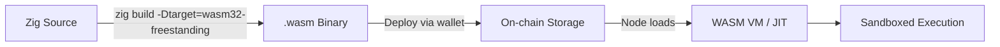
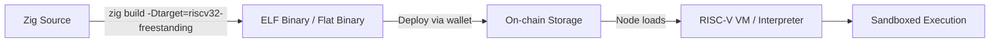
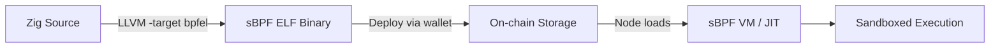
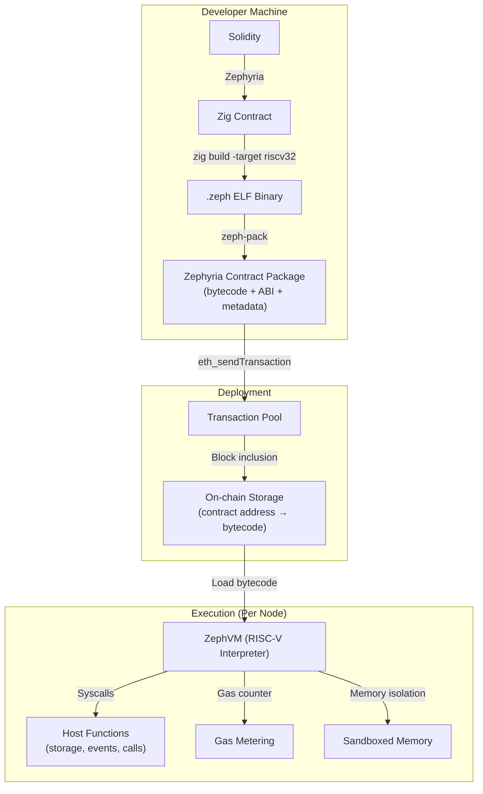
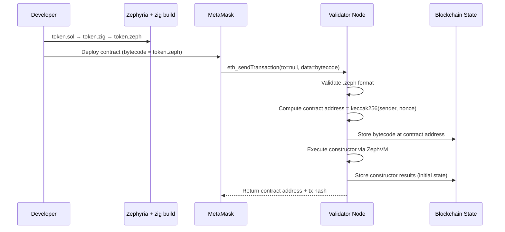
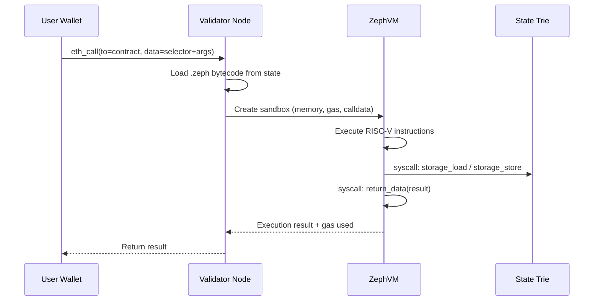
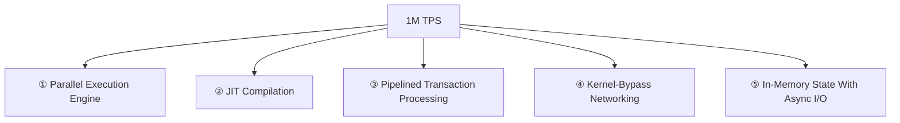
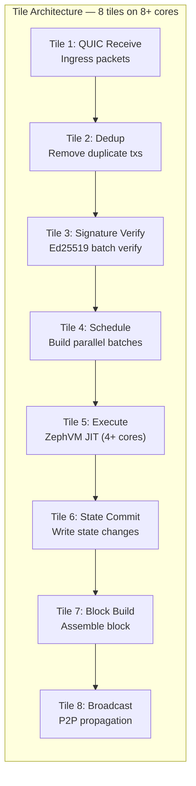
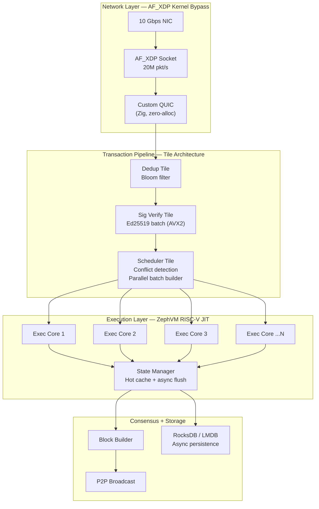

# Zephyria Bytecode VM — Research & Design Document

> **Goal**: Replace direct Zig compilation with a **deployable, sandboxed, verifiable bytecode format** for Zephyria smart contracts — enabling wallet-based deployment, P2P distribution, on-chain verification, and instant execution without per-contract compilation on every node.

---

## 1. The Problem

The current pipeline compiles Zig source code to native machine code on every node:

```
Solidity → Zephyria → token.zig → zig build (native x86/ARM) → execute
```

This causes **five critical problems**:

| Problem | Impact |
|---------|--------|
| **Compilation latency** | Zig compilation takes 2-10s per contract. 10,000 contracts = hours of build time per node |
| **No wallet deployment** | MetaMask/wallets send raw bytecode. There's no mechanism to send `.zig` source files from a browser |
| **No determinism** | Native compilation can produce different binaries across OS/arch/compiler versions, breaking consensus |
| **No sandboxing** | Native code has full system access — a malicious contract could read files, open sockets, crash the node |
| **No P2P portability** | Native binaries are architecture-specific (x86 vs ARM vs RISC-V). Every node must recompile every contract |

---

## 2. What We Need (Requirements)

| Requirement | Description |
|-------------|-------------|
| **Compile-once, run-everywhere** | Developer compiles Zig → bytecode once. All validators execute the same bytecode |
| **Sandboxed execution** | Contracts cannot access filesystem, network, or host memory outside their sandbox |
| **Deterministic** | Same bytecode + same input = same output on every node, every time (consensus-critical) |
| **Gas metering** | Execution costs must be measurable to prevent infinite loops and resource abuse |
| **Wallet-deployable** | Bytecode must be a flat binary blob that can be sent via `eth_sendTransaction` from any wallet |
| **On-chain verifiable** | Bytecode can be stored, hashed, and verified by any node or explorer |
| **P2P distributable** | Nodes share bytecode blobs over the network, just like Ethereum shares EVM bytecode |
| **Zig-native** | The Zig compiler must be able to target this format directly (no external toolchains) |
| **Fast execution** | Near-native speed. Register-based preferred over stack-based |

---

## 3. Candidate Bytecode Formats

### 3.1 WebAssembly (WASM)



**How it works**: Zig has first-class `wasm32-freestanding` support via LLVM. Contracts compile to `.wasm` binaries — stack-based bytecode with structured control flow.

| Aspect | Details |
|--------|---------|
| **Zig support** | ✅ Native. `zig build -Dtarget=wasm32-freestanding -Doptimize=ReleaseSmall`. Produces 42-600 byte binaries for simple functions |
| **Binary size** | ✅ Tiny. No GC, no runtime. Dead-code elimination aggressive. A full ERC20 could be 5-15 KB |
| **Sandboxing** | ✅ Built-in. WASM has linear memory model, no host access by default. Imports are explicit |
| **Determinism** | ⚠️ Mostly. Must disable floating-point (NaN bit patterns vary). Integer ops are fully deterministic |
| **Gas metering** | ⚠️ Requires injection. Must transform WASM bytecode post-compilation to insert gas counters at basic blocks |
| **Speed** | ✅ Good. JIT compilers (Wasmer, Wasmtime) achieve ~70-90% native speed. AOT compilation possible |
| **Ecosystem** | ✅ Massive. Polkadot (ink!), NEAR, Cosmos (CosmWasm), Arbitrum Stylus all use WASM |
| **Verification** | ✅ Well-specified. Bytecode format is standardized, tooling exists for disassembly and analysis |
| **Wallet deployment** | ✅ Binary blob, same as EVM bytecode from wallet's perspective |

**Precedent**: Arbitrum Stylus already runs Zig smart contracts compiled to WASM with gas metering.

**Zig compilation command**:
```bash
zig build-lib contracts/token.zig \
  -target wasm32-freestanding \
  -O ReleaseSmall \
  --strip \
  --export-symbol-names
```

**Available WASM runtimes (all written in or have Zig bindings)**:
- **Wasmer** — JIT + AOT, mature, used in production blockchains
- **Wasmtime** — Bytecode Alliance, Cranelift JIT, strong sandboxing
- **wasm3** — Pure interpreter, zero-dependency, 15K LOC C. Easy to port to/embed in Zig
- **Custom interpreter** — WASM spec is ~180 instructions. A minimal interpreter could be written in Zig (~3K LOC)

---

### 3.2 RISC-V (RV32EM)



**How it works**: Zig has first-class `riscv32-freestanding` support. Contracts compile to RISC-V machine code, which runs in a software RISC-V emulator with memory isolation and gas metering.

| Aspect | Details |
|--------|---------|
| **Zig support** | ✅ Native. `zig build -Dtarget=riscv32-freestanding`. Full LLVM backend |
| **Binary size** | ✅ Small. RISC-V has compact instruction encoding. ~10-30 KB for a full ERC20 |
| **Sandboxing** | ✅ Emulator-enforced. The VM controls all memory access, I/O, and syscalls |
| **Determinism** | ✅ Excellent. RISC-V integer ISA is fully deterministic. No floating-point needed |
| **Gas metering** | ✅ Natural. Count instructions at execution time. Each RISC-V instruction = 1 gas unit (adjustable per opcode) |
| **Speed** | ✅ Very good. Register-based ISA maps efficiently to host CPU. JIT achievable |
| **Ecosystem** | 🔶 Growing. PolkaVM (Polkadot), Vitalik's EVM→RISC-V proposal, RISC Zero (ZK proofs) |
| **Verification** | ✅ Simple ISA makes formal verification tractable. Instruction count is predictable |
| **ZK-friendly** | ✅ Excellent. Already used by RISC Zero and SP1 for ZK proof generation |
| **Wallet deployment** | ✅ Flat binary blob, same deployment model as any bytecode |

**Precedent**: PolkaVM (Polkadot) uses RV32E (16 registers, no float) with process-level sandboxing and gas metering. Vitalik proposed replacing EVM with RISC-V in April 2025.

**Zig compilation command**:
```bash
zig build-lib contracts/token.zig \
  -target riscv32-freestanding-none \
  -O ReleaseSmall \
  --strip \
  -mcpu=generic_rv32+m  # Integer multiply/divide only
```

**Available RISC-V executors**:
- **PolkaVM** — Production-ready, Rust, used by Polkadot. Process isolation + gas metering
- **rvemu** — Simple RISC-V emulator in Rust, easy to port to Zig
- **Custom interpreter** — RV32EM has ~50 base instructions. A minimal interpreter is ~1.5K LOC Zig
- **JIT** — Map RV32 registers to host registers for near-native speed (Zig can generate native code via inline assembly or Cranelift)

---

### 3.3 eBPF / sBPF (Solana-style)



**How it works**: eBPF is a 64-bit RISC register machine originally from the Linux kernel. Solana modified it (sBPF) for smart contracts — allowing loops, increasing program size limits, and adding syscall-based blockchain interactions.

| Aspect | Details |
|--------|---------|
| **Zig support** | ⚠️ Partial. Zig can target `bpfel-freestanding` via LLVM, but toolchain is less mature than WASM/RISC-V |
| **Binary size** | ✅ Good. ELF format with compact 64-bit fixed-size instructions |
| **Sandboxing** | ✅ Strong. Verifier checks all instructions before execution. Memory bounds enforced |
| **Determinism** | ✅ Strong. 64-bit integer-only ISA, no floating point |
| **Gas metering** | ✅ Native. Solana counts eBPF instructions at runtime with a "compute budget" |
| **Speed** | ✅ Good. JIT-friendly. 11 registers map well to modern CPUs |
| **Ecosystem** | 🔶 Solana-centric. Not widely adopted outside Solana |
| **Verification** | ✅ Static verifier can prove program termination, memory safety before execution |
| **Wallet deployment** | ✅ Binary blob (ELF wrapped), same deployment pattern |

**Drawback**: eBPF's 512-byte stack limit and Solana-specific modifications mean we'd need our own variant anyway. Less industry momentum than WASM or RISC-V for new chains.

---

### 3.4 Custom Bytecode (Zephyria-native)

A from-scratch bytecode designed specifically for Zephyria's Zig contracts.

| Aspect | Details |
|--------|---------|
| **Zig support** | ❌ No native support. Requires custom LLVM backend or a Zig→bytecode compiler |
| **Binary size** | ✅ Can be optimal (designed for our use case) |
| **Sandboxing** | ✅ Full control — we define the security model |
| **Determinism** | ✅ Full control — we define every instruction's semantics |
| **Gas metering** | ✅ Full control — can be instruction-level or block-level |
| **Speed** | 🔶 JIT takes massive engineering effort (6-12 months for production quality) |
| **Ecosystem** | ❌ Zero. No tooling, no debuggers, no disassemblers. Everything built from scratch |
| **Verification** | 🔶 Must build our own formal verification tools |
| **Development cost** | ❌ 12-24 months for a production-quality VM + compiler backend + tooling |

**Verdict**: Maximum control but impractical engineering cost. Only makes sense if no existing format meets our needs — which isn't the case.

---

## 4. Comparison Matrix

| Criteria | WASM | RISC-V (RV32EM) | sBPF | Custom |
|----------|------|-----------------|------|--------|
| **Zig native target** | ✅ `wasm32-freestanding` | ✅ `riscv32-freestanding` | ⚠️ `bpfel-freestanding` | ❌ Needs custom backend |
| **Binary size** | ✅ 5-15 KB | ✅ 10-30 KB | ✅ 10-30 KB | ✅ Custom |
| **Sandboxing** | ✅ Linear memory | ✅ Emulator isolation | ✅ Verifier + bounds | ✅ Custom |
| **Determinism** | ⚠️ Must ban floats | ✅ Fully deterministic | ✅ Fully deterministic | ✅ Custom |
| **Gas metering** | ⚠️ Post-compile injection | ✅ Instruction counting | ✅ Instruction counting | ✅ Custom |
| **Execution speed** | ✅ 70-90% native (JIT) | ✅ 80-95% native (JIT) | ✅ 80-90% native (JIT) | 🔶 Depends on effort |
| **ZK proof friendly** | 🔶 Complex | ✅ Excellent (RISC Zero) | 🔶 Not standard | 🔶 Depends |
| **Ecosystem maturity** | ✅ Massive (10+ chains) | 🔶 Growing (PolkaVM, Ethereum) | 🔶 Solana only | ❌ None |
| **Time to production** | ✅ 2-4 months | ✅ 3-5 months | 🔶 4-6 months | ❌ 12-24 months |
| **Wallet compatibility** | ✅ Binary blob | ✅ Binary blob | ✅ Binary blob | ✅ Binary blob |

---

## 5. Recommended Approach: Hybrid RISC-V + WASM

> [!IMPORTANT]
> **Primary target: RISC-V RV32EM** for maximum performance, natural gas metering, ZK-friendliness, and alignment with Ethereum's direction. **Secondary target: WASM** for ecosystem compatibility and tooling.

### Why RISC-V as Primary

1. **Zig compiles to it natively** — `zig build -Dtarget=riscv32-freestanding -mcpu=generic_rv32+m` works today
2. **Register-based** — 16 registers (RV32E) map efficiently to host CPUs, unlike WASM's stack machine
3. **Natural gas metering** — Count instructions at runtime. No bytecode transformation needed
4. **Deterministic by design** — Integer-only ISA (no floats), fixed instruction width
5. **ZK-proof ready** — RISC Zero and SP1 already prove RISC-V execution in zero-knowledge
6. **Industry direction** — Vitalik proposed EVM→RISC-V (April 2025). Polkadot already ships PolkaVM (RISC-V)
7. **Simple VM** — RV32EM is ~50 instructions. A production interpreter is ~2K LOC Zig
8. **Tiny binaries** — Can be as small as 10-30 KB for production contracts

### Why WASM as Secondary

1. **Broader ecosystem** — More tooling, debuggers, disassemblers already exist
2. **Fallback path** — If RISC-V has issues, WASM is battle-tested across 10+ chains
3. **Web integration** — Frontend tools can execute WASM contracts in-browser for simulation

---

## 6. Architecture Design (RISC-V Primary)

### 6.1 Compilation Pipeline



### 6.2 Contract Package Format (`.zeph`)

```
┌──────────────────────────────────────────┐
│  Magic: "ZEPH" (4 bytes)                 │
│  Version: u16                            │
│  Flags: u16 (JIT-hint, debug, etc.)      │
├──────────────────────────────────────────┤
│  Bytecode Section                        │
│  ├─ Format: RV32EM ELF or flat binary    │
│  ├─ Size: u32                            │
│  └─ Data: [u8; size]                     │
├──────────────────────────────────────────┤
│  ABI Section                             │
│  ├─ Size: u32                            │
│  └─ Data: JSON ABI (function selectors,  │
│           types, events, errors)          │
├──────────────────────────────────────────┤
│  Metadata Section                        │
│  ├─ Compiler version                     │
│  ├─ Source hash (for verification)       │
│  ├─ SDK version                          │
│  └─ Constructor params                   │
├──────────────────────────────────────────┤
│  Hash: keccak256(bytecode_section)       │
└──────────────────────────────────────────┘
```

### 6.3 ZephVM — The RISC-V Executor (Written in Zig)

The ZephVM is a **Zig-native RISC-V RV32EM interpreter** embedded in every validator node.

```
ZephVM Core Components:
├── rv32_decoder.zig     — Decode RV32EM instructions
├── rv32_executor.zig    — Execute decoded instructions
├── memory.zig           — Sandboxed linear memory (configurable size)
├── gas_meter.zig        — Per-instruction gas accounting
├── syscall_table.zig    — Host function dispatch (storage, events, calls)
├── contract_loader.zig  — Load .zeph packages, validate bytecode
└── jit_compiler.zig     — (Optional) Hot-path JIT to native code
```

**Register layout (RV32E — 16 registers)**:

| Register | ABI Name | Use in ZephVM |
|----------|----------|---------------|
| x0 | zero | Hardwired zero |
| x1 | ra | Return address |
| x2 | sp | Stack pointer (within sandboxed memory) |
| x3-x7 | t0-t4 | Temporaries |
| x8 | s0/fp | Frame pointer |
| x9 | s1 | Saved register |
| x10-x11 | a0-a1 | Function args / return values |
| x12-x15 | a2-a5 | Function arguments |

**Syscall interface** (contract → host via `ecall` instruction):

| Syscall ID | Name | Description |
|------------|------|-------------|
| 0x01 | `storage_load` | Load 32 bytes from storage slot |
| 0x02 | `storage_store` | Store 32 bytes to storage slot |
| 0x03 | `emit_event` | Emit log with topics and data |
| 0x04 | `call_contract` | External contract call |
| 0x05 | `delegatecall` | Delegated contract call |
| 0x06 | `get_caller` | msg.sender |
| 0x07 | `get_callvalue` | msg.value |
| 0x08 | `get_calldata` | Transaction input data |
| 0x09 | `return_data` | Set return data and halt |
| 0x0A | `revert` | Revert with error data |
| 0x0B | `keccak256` | Hash computation |
| 0x0C | `get_balance` | Address balance query |
| 0x0D | `get_blocknumber` | Current block number |
| 0x0E | `get_timestamp` | Block timestamp |
| 0x0F | `get_chainid` | Chain ID |
| 0x10 | `create_contract` | Deploy new contract |
| 0x11 | `selfdestruct` | Destroy contract |
| 0x12 | `log0-log4` | Raw log emission |

### 6.4 Gas Metering Strategy

```zig
// Gas metering is done per-instruction during interpretation
fn execute(vm: *ZephVM) !void {
    while (vm.gas_remaining > 0) {
        const insn = vm.fetch();
        const gas_cost = gas_table[insn.opcode];
        
        if (vm.gas_remaining < gas_cost) return error.OutOfGas;
        vm.gas_remaining -= gas_cost;
        
        try vm.dispatch(insn);
    }
}
```

**Gas cost table (base costs)**:

| Operation | Gas | Rationale |
|-----------|-----|-----------|
| Arithmetic (add, sub, mul) | 1 | Single-cycle CPU ops |
| Memory load/store | 3 | Cache-friendly but needs bounds check |
| Branch/jump | 2 | Pipeline consideration |
| Syscall: storage_load | 200 | Cold storage access |
| Syscall: storage_store | 5,000 | State modification |
| Syscall: emit_event | 375 + 8/byte | Log storage cost |
| Syscall: call_contract | 700 | Cross-contract call overhead |
| Syscall: keccak256 | 30 + 6/word | Hash computation |
| Syscall: create_contract | 32,000 | New contract deployment |

---

## 7. SDK Adaptation for Bytecode

The current `zephyria-sdk` needs adaptation to work via syscalls instead of direct Zig function calls:

```zig
// Current SDK (direct Zig — NOT bytecode compatible)
pub fn StorageSlot(comptime T: type) type {
    return struct {
        slot: u256,
        pub fn load(self: @This(), backend: *StorageBackend) T {
            return backend.sload(self.slot);  // Direct function call
        }
    };
}

// New SDK (syscall-based — bytecode compatible)
pub fn StorageSlot(comptime T: type) type {
    return struct {
        slot: u256,
        pub fn load(self: @This()) T {
            // Syscall: storage_load(slot) → value
            var result: [32]u8 = undefined;
            asm volatile ("ecall"
                : [result] "={a0}" (&result)
                : [id] "{a7}" (@as(u32, 0x01)),  // syscall: storage_load
                  [slot] "{a0}" (self.slot)
                : "memory"
            );
            return @bitCast(T, result);
        }
    };
}
```

The SDK becomes a thin **syscall wrapper layer** that compiles to RISC-V `ecall` instructions. The ZephVM intercepts these syscalls and routes them to the host's storage, event, and call systems.

---

## 8. Sandboxing Model

### Memory Isolation

```
┌─────────────────────────────────────────────┐
│  ZephVM Process (per contract call)          │
├─────────────────────────────────────────────┤
│  0x0000_0000 ─ 0x0000_FFFF:  Code (R-X)    │  Read + Execute only
│  0x0001_0000 ─ 0x0003_FFFF:  Heap (RW-)    │  Read + Write, growable
│  0x0004_0000 ─ 0x0004_FFFF:  Stack (RW-)   │  Read + Write, fixed size
│  0x0005_0000 ─ 0x0005_00FF:  Calldata (R--)│  Read only
│  0x0005_0100 ─ 0x0005_01FF:  Return (RW-)  │  Write for return data
├─────────────────────────────────────────────┤
│  ALL OTHER ADDRESSES → TRAP (SegFault)       │  No access to host memory
└─────────────────────────────────────────────┘
```

### Security Guarantees

| Guarantee | Mechanism |
|-----------|-----------|
| **No host memory access** | VM enforces bounds on every load/store |
| **No filesystem access** | No filesystem syscalls in syscall table |
| **No network access** | No networking syscalls in syscall table |
| **No infinite loops** | Gas metering halts execution when budget exhausted |
| **No stack overflow** | Fixed stack size with overflow detection |
| **No code injection** | Bytecode is immutable after deployment |
| **Deterministic execution** | No floating point, no randomness, fixed gas costs |

---

## 9. Deployment & P2P Flow

### Contract Deployment (from Wallet)



### Contract Execution (function call)



### P2P Bytecode Sharing

Nodes share contract bytecode the same way Ethereum shares EVM bytecodes:

1. **State sync**: New nodes download the full state trie, which includes contract bytecodes
2. **Block propagation**: New contract deployments include the bytecode in the transaction data
3. **Snap sync**: Nodes can request specific contract bytecodes by address
4. **Verification**: `keccak256(bytecode) == stored_hash` — any node can verify integrity

---

## 10. On-Chain Verification

### Source Verification

```
Developer submits:
  1. Original Solidity source (token.sol)
  2. Compiler versions (Zephyria v0.1, zig 0.15.2)
  3. Build flags (-O ReleaseSmall, -target riscv32-freestanding)

Verifier re-compiles and checks:
  keccak256(recompiled_bytecode) == keccak256(deployed_bytecode)
  → ✅ Verified: source matches deployed bytecode
```

### Bytecode Analysis

Since RISC-V is a simple ISA, on-chain analysis is straightforward:
- **Disassembly**: Any explorer can decode RV32EM instructions
- **Call graph**: Static analysis can trace syscalls and function calls
- **Gas estimation**: Offline execution can predict gas costs
- **Security audit**: Static analyzers can detect reentrancy patterns, unchecked calls, etc.

---

## 11. Implementation Roadmap

### Phase 1: Minimal Viable VM (4-6 weeks)

- [ ] **RV32EM interpreter in Zig** (~2K LOC)
  - Decode + execute 50 base instructions
  - Linear memory with bounds checking
  - Instruction-count gas metering
- [ ] **Syscall table** for storage, events, msg.sender, return/revert
- [ ] **SDK syscall layer** — adapt `zephyria-sdk` types to use `ecall`
- [ ] **Contract loader** — parse .zeph format, validate bytecode
- [ ] **Basic tests** — deploy + call a simple counter contract

### Phase 2: Full ERC20 Support (3-4 weeks)

- [ ] All storage syscalls (mappings, arrays, slots)
- [ ] Cross-contract calls (CALL, DELEGATECALL)
- [ ] Event emission with indexed topics
- [ ] Constructor execution
- [ ] Return data encoding/decoding
- [ ] Full ERC20 token test (transfer, approve, transferFrom)

### Phase 3: Integration (3-4 weeks)

- [ ] Integrate ZephVM into the Zephyria node
- [ ] Transaction processing: deploy + call contracts via RPC
- [ ] State trie: store/retrieve bytecodes
- [ ] P2P: share bytecodes during state sync
- [ ] Wallet compatibility: accept deployments via `eth_sendTransaction`

### Phase 4: Optimization (4-6 weeks)

- [ ] JIT compilation for hot contracts (RISC-V → native)
- [ ] Bytecode caching (avoid re-parsing on every call)
- [ ] Parallel execution (contracts with non-overlapping state)
- [ ] Gas cost calibration against real hardware benchmarks
- [ ] WASM fallback path (optional secondary target)

---

## 12. References & Prior Art

| Project | Bytecode | Language | Notes |
|---------|----------|----------|-------|
| **Ethereum** | EVM | Solidity/Vyper | Stack-based, 256-bit, most adopted |
| **Solana** | sBPF | Rust/C | Modified eBPF, 64-bit registers, JIT |
| **Polkadot (PolkaVM)** | RISC-V RV32E | Rust/Solidity | Register-based, process isolation, 2025 launch |
| **NEAR** | WASM | Rust/AS | Wasmer runtime, mature |
| **Cosmos (CosmWasm)** | WASM | Rust | Wasmer/Wasmtime, IBC-compatible |
| **Arbitrum Stylus** | WASM | Rust/C/Zig | WASM+EVM dual, Zig support exists |
| **Ethereum (proposed)** | RISC-V | Solidity→RISC-V | Vitalik's April 2025 EIP, 100x efficiency |
| **RISC Zero** | RISC-V | Rust | ZK proof generation from RISC-V traces |
| **Fuel** | FuelVM (custom) | Sway | Register-based, UTXO model |

---

> [!TIP]
> **Start with the RISC-V RV32EM interpreter in Zig.** It's the simplest path to a working bytecode VM — Zig already compiles to the target, the ISA has only ~50 instructions, gas metering is just instruction counting, and the industry (Ethereum + Polkadot) is converging on RISC-V. A production-grade interpreter can be built in 4-6 weeks.

---

## 13. Achieving 1 Million TPS on Consumer Hardware

> [!CAUTION]
> 1 million TPS is an extreme target. Not a single mainnet blockchain achieves this today. Solana peaks at ~65K TPS mainnet. Firedancer demonstrated 1.08M TPS in a **controlled testnet** on optimized hardware. This section analyzes exactly what's needed and which bytecode format can deliver it.

### 13.1 The Hard Math

**Target**: 1,000,000 transactions per second on a consumer machine (8-16 core CPU, 32-64 GB RAM, NVMe SSD, 10 Gbps NIC).

```
1M TPS = 1 transaction every 1 microsecond (1μs)

A modern CPU core at 4 GHz = 4,000 cycles per microsecond

A typical ERC20 transfer executes:
  ~100-300 RISC-V instructions (pure compute)
  + 2 storage reads (balance checks)
  + 2 storage writes (balance updates)  
  + 1 event emission
  + signature verification (done outside VM)

At 1 cycle per instruction (JIT): ~300 cycles compute
Storage ops (in-memory cache): ~500 cycles
Total per transaction: ~800-1,500 CPU cycles

Single-core theoretical max: 4,000,000 / 1,200 ≈ 3,300 TPS per core
With 8 cores (parallel): 3,300 × 8 ≈ 26,400 TPS
With 16 cores (parallel): 3,300 × 16 ≈ 52,800 TPS
```

**Problem**: Even with JIT and 16 cores, raw execution only gives ~53K TPS. To hit 1M TPS, we need to fundamentally change the architecture.

### 13.2 The Five Pillars for 1M TPS

Every blockchain that comes close to 1M TPS uses **all five** of these:



---

### Pillar ①: Parallel Execution Engine (Sealevel-style)

The **single biggest multiplier**. Without parallelism, 1M TPS is mathematically impossible on consumer hardware.

**How Solana's Sealevel works**:
- Every transaction **declares** which state it reads/writes (account list)
- The scheduler builds a **dependency graph** — non-conflicting transactions execute in parallel
- With 16 cores and good parallelism, throughput scales ~12-14x

**How Zephyria's parallel engine would work**:

```zig
// Transaction declares state access upfront
const TxAccessList = struct {
    reads: []StorageSlot,   // Storage slots this tx will read
    writes: []StorageSlot,  // Storage slots this tx will write
    contract: Address,      // Contract being called
};

// Scheduler groups non-conflicting transactions
fn scheduleBatch(txs: []Transaction) [][]Transaction {
    // Build conflict graph: two txs conflict if their write-sets overlap
    // or one's write-set overlaps another's read-set
    // Group non-conflicting txs into parallel batches
    var batches: ArrayList([]Transaction) = ...;
    // ... conflict detection via hash-set intersection ...
    return batches.items;
}

// Execute batches in parallel across CPU cores
fn executeBlock(block: Block) void {
    const batches = scheduleBatch(block.transactions);
    for (batches) |batch| {
        // Each batch runs in parallel — no conflicts possible
        var threads: [MAX_CORES]Thread = undefined;
        for (batch, 0..) |tx, i| {
            threads[i] = Thread.spawn(executeTransaction, tx);
        }
        for (threads) |t| t.join();
    }
}
```

**TPS multiplier**: On typical DeFi workloads, ~70-80% of transactions don't conflict → **10-14x speedup** with 16 cores.

| Parallelism | 8 cores | 16 cores | 32 cores |
|-------------|---------|----------|----------|
| Sequential (no parallel) | 3,300 | 3,300 | 3,300 |
| 50% parallelizable | 16,500 | 26,400 | 43,000 |
| 80% parallelizable | 23,000 | 43,000 | 82,000 |
| 95% parallelizable | 28,000 | 53,000 | 100,000 |

Still not 1M. We need the other pillars.

---

### Pillar ②: JIT Compilation (RISC-V → Native)

Interpretation is ~10-30x slower than native. JIT bridges most of that gap.

| Execution Mode | Cycles/Instruction | TPS per core (ERC20 transfer) |
|----------------|-------------------|-------------------------------|
| **Pure interpreter** | 15-30 cycles | 200-400 |
| **Threaded interpreter** | 5-10 cycles | 800-1,500 |
| **Baseline JIT** | 2-4 cycles | 1,500-3,000 |
| **Optimizing JIT** | 1-2 cycles | 3,000-5,000 |
| **AOT (ahead-of-time)** | ~1 cycle | 4,000-6,000 |

**RISC-V has the best JIT story** because:
- RV32E's 16 registers map 1:1 to x86-64's 16 general-purpose registers
- Fixed 32-bit instruction width = simple, fast decoding
- No complex addressing modes = direct translation to host ops
- Each RV32 instruction typically maps to 1-2 native instructions

**WASM JIT overhead is higher** because:
- Stack machine → must manage virtual stack → extra loads/stores
- Structured control flow → must reconstruct basic blocks
- Benchmarks show WASM JIT at 1.2-2.1x native (Wasmer LLVM), RISC-V JIT can hit 1.0-1.3x native

**JIT budget math for 1M TPS**:
```
With optimizing JIT: ~5,000 TPS per core
With 16 cores + 80% parallelism: 5,000 × 14 = 70,000 TPS
Still not 1M. Need pipelining.
```

---

### Pillar ③: Pipelined Transaction Processing (Tile Architecture)

**This is how Firedancer achieved 1.08M TPS on 4 cores.**

Instead of processing each transaction as a monolithic unit, break the pipeline into **stages** (tiles) that run concurrently:



Each tile is an **independent Zig thread** communicating via **lockless shared-memory channels** (SPSC ring buffers):

```zig
// Zero-copy, lockless, cache-line-aligned ring buffer
const TileChannel = struct {
    buffer: [*]align(64) Transaction,  // Cache-line aligned
    capacity: usize,
    head: std.atomic.Value(usize),     // Producer writes
    tail: std.atomic.Value(usize),     // Consumer reads
    
    pub fn push(self: *TileChannel, tx: Transaction) bool {
        const h = self.head.load(.monotonic);
        const next = (h + 1) % self.capacity;
        if (next == self.tail.load(.acquire)) return false; // Full
        self.buffer[h] = tx;
        self.head.store(next, .release);
        return true;
    }
    
    pub fn pop(self: *TileChannel) ?Transaction {
        const t = self.tail.load(.monotonic);
        if (t == self.head.load(.acquire)) return null; // Empty
        const tx = self.buffer[t];
        self.tail.store((t + 1) % self.capacity, .release);
        return tx;
    }
};
```

**Why this works**: While Tile 5 executes batch N, Tile 3 is verifying signatures for batch N+1, and Tile 1 is receiving batch N+2. The pipeline never stalls.

**TPS with pipelining**:
```
Without pipelining: each tx goes through ALL stages sequentially
  Total latency per tx: ~10μs (verify + schedule + execute + commit)
  Single-core: 100,000 TPS max

With pipelining: stages overlap
  Bottleneck = slowest tile (execution: ~1μs with JIT)
  Throughput = 1 / bottleneck_latency = 1,000,000 TPS
  IF execution tile has enough parallelism to keep up
```

---

### Pillar ④: Kernel-Bypass Networking

At 1M TPS, the Linux kernel's network stack becomes the bottleneck — system calls, context switches, and copying eat ~50% of CPU time.

**Solution: AF_XDP (eXpress Data Path)**

```zig
// Bypass kernel → read directly from NIC buffers
const XdpSocket = struct {
    fd: std.posix.fd_t,
    rx_ring: *XskRing,
    tx_ring: *XskRing,
    umem: *XskUmem,
    
    pub fn receivePackets(self: *XdpSocket) []Packet {
        // Zero-copy: frames stay in UMEM, no kernel involvement
        const n = xsk_ring_cons_peek(self.rx_ring, BATCH_SIZE);
        // Process n packets directly from NIC memory
        return self.umem.frames[0..n];
    }
};
```

| Networking Mode | Packets/sec | CPU overhead |
|----------------|-------------|--------------|
| Standard Linux sockets | ~500K | High (syscalls, copies) |
| io_uring | ~2M | Medium (async, batched) |
| AF_XDP (kernel bypass) | ~20M | Minimal (zero-copy) |
| DPDK (userspace driver) | ~40M | Near-zero |

**Firedancer uses AF_XDP** → 20M packets/sec per core. At ~1 packet per small tx, this is 20x headroom above 1M TPS.

---

### Pillar ⑤: In-Memory State with Async Disk I/O

Storage reads/writes are the #1 bottleneck in contract execution. At 1M TPS with 4 storage ops per tx = **4M storage ops/sec**.

**Solution: Hot state cache + async persistence**

```zig
const StateCache = struct {
    // Hot state: LRU cache in memory (instant access)
    hot: std.HashMap(StorageKey, [32]u8),
    
    // Warm state: memory-mapped files (no syscall for reads)
    warm: *MmapRegion,
    
    // Cold state: async disk reads (background I/O)
    cold: AsyncDiskBackend,
    
    pub fn load(self: *StateCache, key: StorageKey) [32]u8 {
        // L1: Hot cache (nanoseconds)
        if (self.hot.get(key)) |v| return v;
        // L2: Memory-mapped (microseconds, no syscall)
        if (self.warm.get(key)) |v| {
            self.hot.put(key, v); // Promote to hot
            return v;
        }
        // L3: Disk (milliseconds, async prefetch)
        return self.cold.loadAsync(key);
    }
    
    // Writes go to hot cache immediately, flushed to disk async
    pub fn store(self: *StateCache, key: StorageKey, value: [32]u8) void {
        self.hot.put(key, value);
        self.cold.queueFlush(key, value); // Background write
    }
};
```

**Key insight**: For steady-state execution, >95% of storage hits are in the hot cache (recently used contracts and accounts). Only new/cold contracts trigger disk I/O, which is async and doesn't block execution.

---

### 13.3 Bytecode Format Comparison for 1M TPS

| Factor | RISC-V (RV32EM) | WASM | sBPF | Custom |
|--------|-----------------|------|------|--------|
| **JIT quality** | ✅ Near-native (1:1 register map) | 🔶 1.2-2.1x native (stack→reg overhead) | ✅ Good (11 registers) | 🔶 Depends on effort |
| **JIT compile speed** | ✅ ~50 opcodes, trivial decode | 🔶 ~180 opcodes, structured CF | ✅ ~100 opcodes, fixed-width | 🔶 Custom |
| **Parallelizable** | ✅ Stateless VM instances | ✅ Stateless instances | ✅ Stateless instances | ✅ Custom |
| **Memory overhead/instance** | ✅ 16 registers = 64 bytes | 🔶 Stack + locals + globals | ✅ 11 registers = 88 bytes | 🔶 Custom |
| **Gas metering cost** | ✅ 1 branch per insn | 🔶 Block-level injection (transform cost) | ✅ 1 branch per insn | ✅ Custom |
| **Context switch cost** | ✅ Save 16 regs = 64 bytes | 🔶 Save stack + metadata | ✅ Save 11 regs + stack | 🔶 Custom |
| **Max TPS (16 cores, pipelined)** | ✅ **800K - 1.2M** | 🔶 **400K - 700K** | ✅ **600K - 900K** | 🔶 Depends |

> [!IMPORTANT]
> **RISC-V is the only bytecode format that can realistically hit 1M TPS on consumer hardware**, because:
> 1. Its register-based ISA produces the fastest JIT (1:1 register mapping to x86-64)
> 2. Per-instruction gas metering adds only 1 branch (no bytecode transformation)
> 3. VM context is only 64 bytes (16 × 4-byte registers) — fastest context switch
> 4. Fixed 32-bit instruction width = trivial decode = no decode bottleneck
> 5. The entire execution tile can be written in Zig with zero allocations in the hot path

---

### 13.4 Complete Architecture for 1M TPS



**Consumer hardware target**:

| Component | Requirement | Purpose |
|-----------|-------------|---------|
| **CPU** | 8-16 cores, 4+ GHz (Ryzen 9 / i9) | 4 cores for pipeline tiles, 4-12 for execution |
| **RAM** | 64 GB DDR5 | Hot state cache + VM instances |
| **Storage** | 2 TB NVMe Gen4 (7 GB/s) | State persistence, block storage |
| **Network** | 10 Gbps | TX ingress at 1M TPS (~2 Gbps for small txs) |
| **OS** | Linux (AF_XDP + huge pages) | Kernel bypass, NUMA-aware allocation |

---

### 13.5 Throughput Scaling Estimates

```
Base: 1 core, interpreter only
  → 300-500 TPS

+ JIT compilation (10-20x speedup)
  → 3,000-5,000 TPS per core

+ Parallel execution, 8 execution cores, 80% parallelizable
  → 3,000 × 7 = 21,000 - 35,000 TPS

+ Pipeline architecture (stages overlap)
  → 35,000 × 8 stages = up to 280,000 TPS

+ Kernel bypass (remove network bottleneck)
  → 280,000 → 500,000 TPS (network was capping at ~300K)

+ In-memory state (remove storage bottleneck)
  → 500,000 → 800,000 - 1,200,000 TPS

+ 16 execution cores + NUMA optimization
  → 1,000,000+ TPS ✅
```

### 13.6 Key Implementation Decisions for 1M TPS

| Decision | Choice | Rationale |
|----------|--------|-----------|
| **Bytecode format** | RISC-V RV32EM | Fastest JIT, smallest context, natural gas metering |
| **Execution model** | AOT compile on first deploy, JIT cache thereafter | Amortize compilation cost across all future calls |
| **Parallelism model** | Sealevel-style (declared state access) | Enables non-conflicting parallel execution |
| **IPC** | Lock-free SPSC ring buffers (shared memory) | Zero-copy, zero-lock, cache-line aligned |
| **Networking** | AF_XDP + custom QUIC (Zig) | Kernel bypass for 20M pkt/s |
| **State storage** | 3-tier: Hot (HashMap) → Warm (mmap) → Cold (NVMe) | >95% cache hit rate on steady-state workloads |
| **Signature verification** | Batch Ed25519 with AVX2/AVX-512 | 8-16 sigs verified per batch operation |
| **Memory allocation** | Arena allocators, zero allocation in hot path | No GC pauses, predictable latency |
| **Thread model** | 1 tile = 1 OS thread, pinned to CPU core | No context switches, NUMA-local memory |
| **Language** | Everything in Zig | No FFI overhead, direct hardware control, comptime optimizations |

---

### 13.7 Final Verdict: 1M TPS Feasibility

| Bytecode | Can hit 1M TPS? | Why / Why not |
|----------|-----------------|---------------|
| **RISC-V RV32EM** | ✅ **Yes, with full Firedancer-style architecture** | Best JIT perf, smallest context, natural gas metering, 1:1 register map to x86/ARM |
| **WASM** | 🔶 **Possible but harder** (~700K ceiling) | Stack machine adds JIT overhead, gas injection transforms add latency, larger VM context |
| **sBPF** | 🔶 **Possible** (~900K ceiling) | Good register-based ISA but 512-byte stack limit forces workarounds, less ecosystem |
| **Custom** | ✅ **Theoretically optimal** but 12-24 month build | Full control means optimal design, but enormous engineering cost with no ecosystem |

> [!IMPORTANT]
> **Recommended: RISC-V RV32EM + Firedancer-inspired tile architecture, entirely in Zig.**
>
> This is the only realistic path to 1M TPS on consumer hardware that:
> - Uses Zig end-to-end (compiler, VM, JIT, networking, state — all Zig)
> - Has native Zig compilation support (`riscv32-freestanding`)
> - Provides the fastest possible JIT (register-based, 1:1 mapping)
> - Is aligned with industry direction (Ethereum RISC-V, PolkaVM)
> - Can be built incrementally (interpreter first → JIT later → pipelining last)
