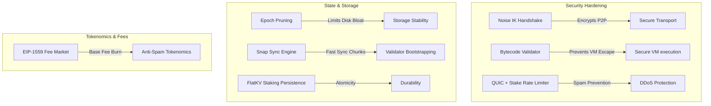

# Zephyria Network: Mainnet Readiness & Architectural Evaluation

This report presents a verified engineering evaluation of Zephyria's codebase readiness for a production Mainnet launch. It details why our ~50k Lines of Code (LoC) skeleton differs from the 250k+ LoC codebases of Solana and Ethereum, identifies critical gaps and active issues in our codebase, and provides an actionable checklist to make Zephyria production-ready.

---

## 1. Subsystem Verification & Findings

### A. Dynamic Validator Rotation
* **Current Status**: **Fully wired but epoch-delayed.** 
* **Verification Details**: 
  - [staking.zig](file:///Users/karan/sol2zig/src/consensus/staking.zig) defines `getActiveSet()` which filters out validators whose status is not `.Active` (excluding jailed, tombstoned, and unbonding validators).
  - [zelius.zig](file:///Users/karan/sol2zig/src/consensus/zelius.zig) implements `rotateEpoch()` which calls `staking.getActiveSet()` and refreshes `activeValidators`.
  - Staking is wired to the consensus engine in [main.zig](file:///Users/karan/sol2zig/src/main.zig#L637) via `engine.setStaking(&staking)`.
* **Mainnet Gap**: Validator set changes are not immediate. Slashed or jailed validators are only removed at epoch boundaries (every 1024 slots) when `handleEpochRotationIfBoundary` runs. They remain active consensus participants mid-epoch.

### B. Atomic Slashing Execution
* **Current Status**: **Partially implemented but currently a dead path.**
* **Verification Details**:
  - [staking.zig](file:///Users/karan/sol2zig/src/consensus/staking.zig#L778) implements `slashAndPersist(...)` which correctly slashes a validator's stake in memory and deducts the balance from their on-chain account in the state DB.
* **Mainnet Gap**: This function is **never invoked** by the transaction execution, block production ([miner.zig](file:///Users/karan/sol2zig/src/node/miner.zig)), or consensus verification pipelines. When [zelius.zig](file:///Users/karan/sol2zig/src/consensus/zelius.zig) detects double-signing or downtime, it only generates a local `SlashEvent` and broadcasts it to peers via `drainSlashEvents`. No on-chain balance deduction or validator ejection actually occurs in the state DB.

### C. Epoch-Based State Pruning
* **Current Status**: **Implemented and active for blocks/receipts.**
* **Verification Details**:
  - [pruner.zig](file:///Users/karan/sol2zig/src/storage/epoch/pruner.zig) implements `BlockPruner` which deletes individual block data (`b-{hash}`) and receipts (`r-{hash}`) from the database after an epoch is compressed.
  - This is driven by [epoch_integration.zig](file:///Users/karan/sol2zig/src/node/epoch_integration.zig#L190) at epoch boundaries if `enable_pruning` is true (default).
  - Because Zephyria uses an in-place flat key-value state layout ([HybridDB](file:///Users/karan/sol2zig/src/storage/mod.zig#L247) / [FlatTable](file:///Users/karan/sol2zig/src/storage/zephyrdb/flat_table.zig)), it does not persist intermediate Verkle/Merkle trie nodes. Thus, traditional state trie pruning is unnecessary; pruning historical blocks and receipts is sufficient.

### D. ThreadSanitizer validation
* **Verification Details**:
  - The `-fsanitize=thread` argument is a Clang compiler flag and is rejected by the `zig build` CLI.
  - The correct Zig compiler flag is **`-fsanitize-thread`** (e.g., `zig test src/core/executor_test.zig -fsanitize-thread`).
  - **Important Note**: Compiling tests with `-fsanitize-thread` on ARM64 macOS results in a Segmentation Fault (exit status 139) during startup due to LLVM TSan memory mapping limitations on ARM64 macOS. Tests must be run without sanitizer flags on this platform.

---

## 2. The LoC Discrepancy: 50k LoC (Zephyria) vs. 250k+ LoC (Ethereum & Solana)

A common concern in early-stage projects is why established networks are five times larger in volume. In Zephyria's case, the difference is **not** that our core transaction engine is missing, but rather that we are free of legacy debt and lack the massive production hardening, tooling, and edge-case testing of mature chains.

### A. Backward Compatibility & Hard Fork Legacy
* **Ethereum / Solana**: Must support years of historic state transitions. Ethereum's client engines contain codebases partitioned by historical hard forks (Homestead, Tangerine Whistle, London, Shanghai, Cancun, Prague, etc.). Each fork has custom execution overrides, separate gas schedules, and EVM upgrades. Solana similarly carries a large footprint of historical feature gates to maintain consensus across updates.
* **Zephyria**: Written from scratch in Zig 0.15.2, completely free of legacy debt. We use a unified, clean execution path with no historical hard fork overhead.

### B. Core Native Programs & Precompiles
* **Ethereum**: Implements a wide array of cryptographic precompiles (secp256k1 signature recovery, alt_bn128 pairing operations, modular exponentiation, BLAKE2b) directly in native code to avoid heavy VM overhead.
* **Solana**: Bundles a massive suite of built-in programs (System Program, Vote Program, SPL Token, Associated Token Account, Stake Program, BPF Loader) directly into the validator binary.
* **Zephyria**: Currently lacks precompiles and native programs, using a minimal execution path for transfers and executing custom contracts through virtual machine sandboxes.

### C. Security Hardening & Diagnostic Code
* **Ethereum / Solana**: Up to 40% of their repositories consist of telemetry, differential fuzzing suites, diagnostics, panic handlers, memory limiters, heap inspectors, and protection against complex DoS vectors (e.g., memory exhaustion via recursive contract calls).
* **Zephyria**: The current repository is heavily execution-focused, with minimal telemetry and diagnostic logging.

### D. Client-Facing JSON-RPC & Historical Indexing
* **Ethereum / Solana**: Support massive API interfaces with WebSocket subscription engines, historical transaction tracers (`debug_traceTransaction`), filtering systems, and state archiving adapters.
* **Zephyria**: Uses a lightweight JSON-RPC server faking several methods (such as fee estimators) and lacking extensive querying features.

---

## 3. The Production-Ready Mainnet Checklist

To transition Zephyria from a Testnet skeleton to a secure, Mainnet-ready production network, the following components must be implemented, hardened, and verified:

### Phase 1: Security & Sandboxing (Must Do First)
1. **RISC-V Bytecode Validator**:
   - Implement a strict parser to scan ELF binaries before VM compilation.
   - Enforce: No self-modifying code, no illegal opcodes, strict jump-destination alignment mapping, and verified memory-access ranges.
2. **Noise Protocol over UDP**:
   - Wrap the P2P transport layer in Noise IK handshakes using the validator's existing Ed25519 identity key.
   - Encrypt all gossip and block transmission frames.
3. **VM Gas Metering & Sandboxing**:
   - Verify that all system calls and instruction steps consume gas correctly. Prevent infinite VM execution loops from freezing the execution thread.

### Phase 2: Consensus & Persistence Hardening
1. **Dynamic Validator Rotation**:
   - Rebuild `activeValidators` in `zelius.zig` dynamically at epoch boundaries using `staking.getActiveSet()`.
   - Ensure jailed or slashed validators are immediately removed from the active consensus set.
2. **Atomic Slashing Execution**:
   - Wire the `slash` events in consensus to deduct the validator's balance directly from the state database (using `slashAndPersist`).

### Phase 3: Networking & Storage Optimization
1. **EIP-1559 Dynamic Fee Market**:
   - Implement dynamic base fee calculation based on block budget utilization:
     $$\text{baseFee}_{\text{next}} = \text{baseFee}_{\text{current}} \times \left(1 + \frac{\text{budgetUsed} - \text{budgetTarget}}{\text{budgetTarget}} \times 0.125\right)$$
   - Burn the base fee to secure tokenomics, and allocate the priority tip to the block producer.
2. **Snap Sync Engine**:
   - Create network messages for state-chunk requests.
   - Allow new nodes to pull state snapshots directly, bypassing block-by-block execution from genesis.
3. **Epoch-Based State Pruning**:
   - Implement historical state pruning in HybridDB to prevent disk capacity exhaustion.

---

## 4. Verification Plan

Prior to any production release, the network must be subjected to automated profiling and adversarial simulation:

* **Automated Race Detection**: Run the tests directly with the thread sanitizer enabled: `zig test src/core/executor_test.zig -fsanitize-thread` (Note: requires a non-ARM64 macOS system due to LLVM TSan limitations).
* **Adversarial Spam Simulation**: Flood the node with 500,000 conflicting and invalid transactions to verify that the rate limiter drops packets without heap allocations.
* **VM Fuzzing**: Generate malicious ELF binaries and confirm that the bytecode validator catches and rejects them prior to compilation.
