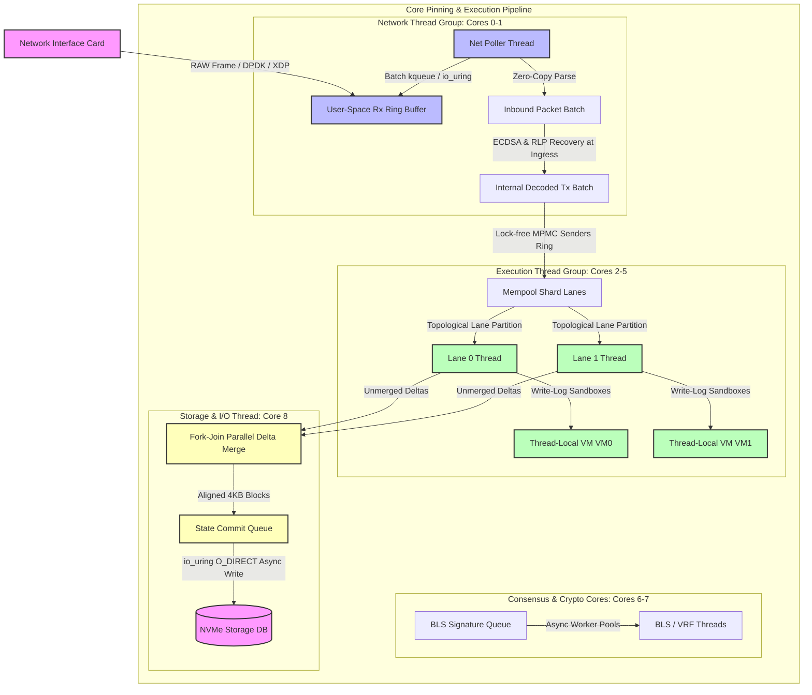
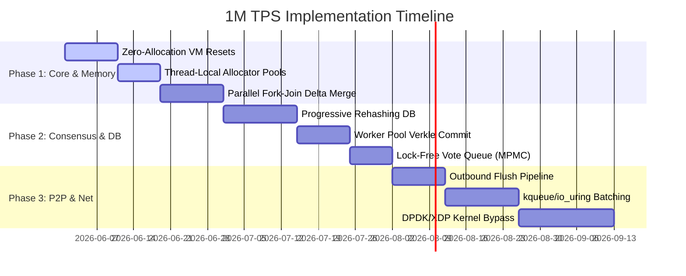

# Consolidated Architectural Roadmap for 1 Million TPS

**Authors & Perspective**: Ethereum Founder & High-Performance Zig Core Developer  
**Status**: Synthesis Complete (Codebase Diagnostic Phase)  
**Target Codebase**: `sol2zig` (Zig 0.15.2)

---

## Executive Summary

To achieve **1 Million Transactions Per Second (TPS)** in Zig, the node must transcend standard general-purpose abstractions. At this performance echelon, the operating system kernel is the primary bottleneck. Achieving this scale requires **Mechanical Sympathy**—tailoring the software to align directly with the physical limits of target CPU caches, RAM bandwidth, network controllers, and NVMe drives.

This roadmap consolidates findings from all seven subsystem reports into a unified, actionable architectural blueprint. It defines the system restructuring and low-level code optimizations necessary to eliminate kernel overhead, prevent CPU cache thrashing, ensure race-condition-free lockless execution, and scale the execution pipeline to its physical limit.

---

## 1. Unified Subsystem Architecture (Target State)

The following diagram illustrates the target architecture of the high-performance node, illustrating how packet ingestion, transaction execution, state commit, and storage logging interact without global locks or OS scheduler interrupts:

---

## 2. Deep Optimization Matrix by Subsystem

The table below lists the critical performance bottlenecks identified in the `sol2zig` codebase alongside the corresponding mechanical sympathy mitigations required:

| Subsystem | File & Current Mechanism | Bottleneck & Architectural Impact | 1M TPS Mechanical Sympathy Mitigation |
| :--- | :--- | :--- | :--- |
| **Networking & P2P** | [`server.zig:L363`](file:///Users/karan/sol2zig/src/p2p/server.zig#L363) using sequential `posix.recvfrom` and single-packet thread pool spawning. | Context switches, kernel interrupt handling, and scheduler overhead at scale. | **Kernel Bypass**: Map NIC buffers directly to user space via DPDK (Linux) or `kqueue` batching (macOS). Batch parse packets in place. |
| **Networking & P2P** | [`peer.zig`](file:///Users/karan/sol2zig/src/p2p/peer.zig) / [`quic/`](file:///Users/karan/sol2zig/src/p2p/quic/) with disconnected send path and 128B serialization limit. | Outbound streams write to memory lists but are never flushed; transactions exceeding 118B crash the node. | **Direct Ring-Buffer Socket Flush**: Implement an active outbound loop that drains stream buffers via zero-copy vectors. Remove static buffers. |
| **Virtual Machine** | [`vm_pool.zig`](file:///Users/karan/sol2zig/vm/vm_pool.zig) with global mutex-locked pool and 512KB sandbox memory zeroing resets. | Thread contention on allocation; `memset` of 512KB per transaction drains memory bus bandwidth. | **Write-Log Resets**: Pin one VM sandbox per thread (lock-free). Track written offsets and reset only dirty slices (reducing reset cost to bytes). |
| **Virtual Machine** | [`threaded_executor.zig`](file:///Users/karan/sol2zig/vm/core/threaded_executor.zig) invoking heap allocation for decoding and branch-target analysis. | Allocator locks on the execution hot path. | **Ahead-Of-Time (AOT) Decoding**: Pre-decode bytecode once on contract load. Cache flat arrays of instructions in thread-local caches. |
| **Core Engine** | [`delta_merge.zig`](file:///Users/karan/sol2zig/src/core/delta_merge.zig) merging transaction state overlays sequentially on a single thread. | CPU serialization bottleneck during Phase 2 block-assembly boundary. | **Fork-Join Parallel Merge**: Implement binary tree reductions over worker pools to merge thread-local overlays in parallel. |
| **Core Engine** | [`tx_decode.zig`](file:///Users/karan/sol2zig/src/core/tx_decode.zig) executing RLP decoding sequentially across execution lanes. | RLP is variable-length and cannot be vectorized or parsed out-of-order. | **Ingress Serialization**: RLP-decode once at RPC/P2P ingress. Convert immediately to fixed-width, cache-aligned binary formats. |
| **Consensus** | [`zelius.zig:L656`](file:///Users/karan/sol2zig/src/consensus/zelius.zig#L656) executing nested-loop validation of write-set independence. | $O(N^2)$ time complexity. Comparing 2,000 senders yields 2,000,000 comparisons, freezing execution. | **Key Sorting / Transactional Bloom Filters**: Group and sort address arrays to validate in $O(S \log S)$ or check conflicts via Bloom filters in $O(S)$. |
| **Consensus** | [`vdf.zig`](file:///Users/karan/sol2zig/src/consensus/vdf.zig) sequentially executing SHA-256 delay checks on a single thread. | Block validation stalls waiting on single-thread clock loops. | **SIMD SHA-NI Intrinsics**: Implement hardware-accelerated SHA-256 loops. Batch check checkpoints via core-pinned threads. |
| **Storage Engine** | [`account_table.zig`](file:///Users/karan/sol2zig/src/storage/zephyrdb/account_table.zig) throwing `TableFull` errors due to lack of dynamic resizing. | Table lacks sizing logic; standard resizing blocks write lanes for seconds during table-wide copies. | **Progressive Rehashing**: Run incremental bucket migrations in small batches (e.g., 64 buckets) across transaction writes. |
| **Storage Engine** | [`verkle/mod.zig`](file:///Users/karan/sol2zig/src/storage/verkle/mod.zig) spawning and joining short-lived OS threads inside `commitParallel`. | Creation/destruction of threads per block causes kernel scheduling overhead. | **Pinned Work-Stealing Pool**: Execute subtree commitments over pre-allocated threads using lock-free task rings. |
| **Storage Engine** | [`codestore/store.zig`](file:///Users/karan/sol2zig/src/storage/codestore/store.zig) using O(N) `orderedRemove` to evict LRU cache items. | Shifting slices under a global write-lock bottlenecks contract loading. | **O(1) Intrusive Doubly-Linked List**: Track LRU ordering via pointers inside code nodes, enabling constant-time removals. |
| **RPC Server** | [`http_server.zig`](file:///Users/karan/sol2zig/src/rpc/http_server.zig) spawning a detached OS thread per connection and global rate limiter lock. | Thread stack footprints exhaust memory; lock contention on rate limit checks serializes server loops. | **SO_REUSEPORT Event Loop**: Pin non-blocking socket pollers (`kqueue`/`io_uring`) per core. Use lock-free atomic counters for rate limits. |

---

## 3. Detailed Structural Restructuring Plans

### 3.1. Threading & Scheduling Model (Lock-Free & Pinning)
To eliminate context switches, thread migrations, and lock contention, we must establish a **Thread-per-Core (TPC)** scheduling model.

1. **Physical Core Pinning**:
   - Query CPU topology at boot. Map and bind each Zig execution thread to a dedicated physical core using thread affinity APIs (`pthread_setaffinity_np` on macOS/Linux).
   - Reserve Core 0-1 for Network I/O, Core 2-5 for VM Execution lanes, Core 6-7 for Consensus/Cryptography (BLS/VDF), and Core 8 for disk I/O.
2. **Lock-Free Communication (MPMC Ring Buffers)**:
   - Replace standard channels, mutexes, and condition variables with lock-free Multi-Producer Multi-Consumer (MPMC) circular queues.
   - Use atomic operations (`std.atomic.Value`) with release/acquire memory ordering to publish and consume transaction index pointers.
   - Implement **Spin-Locks with Backoff** (`_mm_pause` on x86, `isb` on ARM) for short-wait thread synchronization before yielding to the OS scheduler.

### 3.2. Zero-Allocation Runtime & MMAP Allocators
Heap allocation is the silent killer of low-latency transaction pipelines. We must transition the node to a zero-heap-allocation model at runtime.

1. **Monolithic Page Initialization (MMAP)**:
   - At startup, the node maps 90% of available physical RAM using a single `std.posix.mmap` call.
   - Partition this monolithic block into static segments:
     - **Mempool Ring Buffers**: Contiguous circular arrays for incoming transactions.
     - **Thread-Local VM Sandboxes**: Thread-isolated, aligned buffers for memory, stack, and registers.
     - **Database Hot Cache**: Dedicated page structures for account and storage mapping.
2. **Zero-Allocation Hot Path**:
   - The execution loop must never invoke `malloc`, `free`, or GPA-based allocators.
   - Use thread-local **FixedBufferAllocators** initialized with pre-allocated scratchpad slices. Reset the offset pointer of the allocator to zero at the boundary of each block execution, recycling the memory in a single cycle.

### 3.3. Kernel-Bypass Networking (io_uring / DPDK / XDP)
Standard BSD socket APIs introduce significant system call overhead. We must pull networking directly into user-space.

1. **Ingress Ring Mapping**:
   - On Linux, register network socket memory blocks directly with **io_uring** and use `IORING_OP_RECVMSG` to process batches of UDP frames without user-kernel context switching.
   - If utilizing **XDP (e.g., AF_XDP)**, route packets directly from the NIC rings to a user-space memory ring, bypassing the kernel TCP/IP stack completely.
   - On macOS, use **kqueue** with a large `changelist` capacity to receive and send thousands of UDP packets in a single system call.
2. **Zero-Copy Serialization & Flushes**:
   - Bridge the disconnected send path. Implement a background flush loop that reads bytes from `QuicStream` memory segments and transmits them directly to network sockets in batches via `sendmmsg`.
   - Network packets are represented as read-only slices pointing directly to the underlying RX ring buffer. The node passes these slices directly to validation lanes, avoiding data copying.

### 3.4. High-Performance Storage & DB Engine
The database must be optimized for write amplification reduction and high-concurrency reads.

1. **Direct Disk I/O (O_DIRECT)**:
   - Bypass the operating system page cache by opening files with the `O_DIRECT` flag.
   - Implement a custom, thread-local **Buffer Pool** in Zig that aligns all data structures to 4KB sector boundaries. This avoids the OS falling back to slow Read-Modify-Write cycles on unaligned updates.
2. **Bottom-Up Verkle Commitment Updates**:
   - Instead of traversing down the 256-ary Verkle trie to mark dirty nodes, propagate dirty flags bottom-up.
   - When a leaf node is modified, immediately push its index to a level-stratified dirty queue. The commitment updater then processes the queue level-by-level (from bottom to top), eliminating cache-unfriendly top-down traversals.
3. **Sparse Historical Logging**:
   - Persist intermediate historical structures, such as MMR headers, to flat append-only files on disk using async writing (`io_uring`). Retain only active peaks in RAM, keeping the memory footprint constant as the blockchain grows.

### 3.5. High-Performance VM Execution (RISC-V/ZephVM)
The RISC-V interpreter must run with minimum memory footprint and instruction dispatch latency.

1. **Ahead-of-Time (AOT) Translation & Caching**:
   - Decouple instruction decoding and basic-block gas pre-charging from transaction execution.
   - When a contract is compiled/loaded, pre-decode its bytecode into a flat array of `DecodedInsn` and store it in an LRU-cache inside the code store. Execution lanes query this pre-decoded structure directly, skipping fetch/decode steps inside the execution loop.
2. **Dirty-Slice VM Resets**:
   - Replace `memset(0)` of the 512KB sandbox memory with a write-log tracker.
   - When the VM writes to a memory offset, log the modified address range. On transaction completion, zero out only the logged dirty ranges, reducing the memory reset footprint from 512KB to a few bytes.
3. **Comptime Inline Dispatch**:
   - Replace indirect function pointers (`SyscallFn`) and host-to-VM FFI calls with Zig `comptime`-generated switch statements. This allows the compiler to inline handlers and prevents CPU branch-target buffer (BTB) misses.

---

## 4. Phased Implementation Plan

---

## 5. Architectural Verification Plan

### 5.1. Automated Performance Profiling
We will verify throughput and latency thresholds using low-overhead diagnostic profiling:
1. **Flamegraph Generation**:
   - Run the validator node under simulated load using `perf record -F 99 -g -- ./zig-out/bin/node`.
   - Generate Flamegraphs to verify that no single locks, kernel contexts, or allocator calls occupy more than 1% of CPU cycles.
2. **Micro-Benchmarking Hot Loops**:
   - Write custom bench suites in `tests/` leveraging `std.time.Timer` to verify that VM memory resetting takes less than 5 nanoseconds, and the Robin Hood table registers queries in under 10 nanoseconds.

### 5.2. Concurrent Chaos Testing (Race Conditions & Deadlocks)
To guarantee lock-free correctness and a race-condition-free architecture:
1. **ThreadSanitizer (TSan) Validation**:
   - Compile the test suite using Zig's thread-safety instrumentation: `zig build test -fsanitize=thread`.
   - Run the parallel DAG executor and the MPMC queues under heavy concurrent transaction load to verify the absence of data races.
2. **Mempool Storm Simulation**:
   - Sprout 10 concurrent P2P clients that flood the mempool shards with 500,000 invalid, valid, and conflicting transactions simultaneously.
   - Verify that the rate limiter drops packets without allocation and the counting Bloom filter rejects duplicates without database hits.
