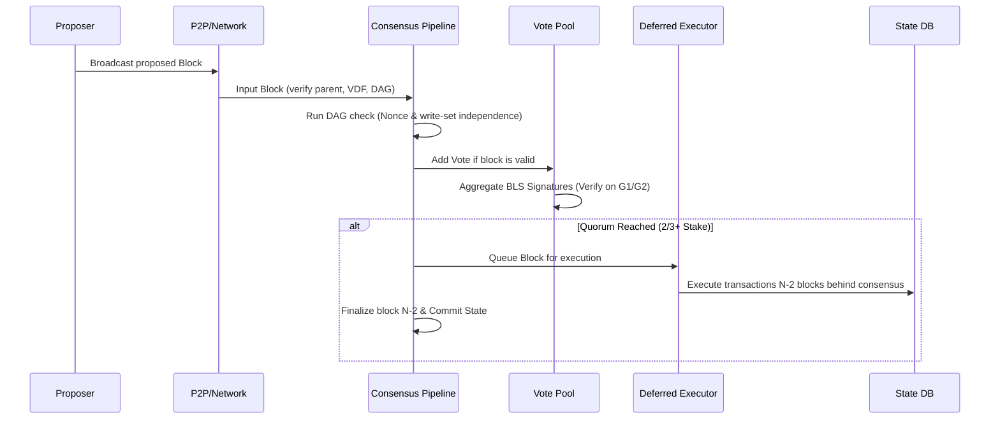

# Zephyria Consensus System Analysis (`src/consensus/`)
**Role/Perspective**: Ethereum Founder & High-Performance Zig Core Developer  
**Status**: Analysis Complete (No Code Changes)

This report details the deep-dive architectural analysis of Zephyria’s consensus engine, located in `src/consensus/`. We analyze each file’s role, the overall flow of the three-tier adaptive consensus, and critical bottlenecks that stand in the way of achieving 1 million Transactions Per Second (TPS).

---

## 1. Subsystem Architecture & File-by-File Roles

The `src/consensus/` directory implements a **Three-Tier Adaptive PoS Consensus Protocol (Loom Genesis)** designed to scale from small validator networks to massive, decentralized validator groups:
- **Tier 1 (Full BFT)**: Active when $N \le 100$. All validators participate in classic BLS-based Byzantine Fault Tolerant consensus.
- **Tier 2 (Committee Loom)**: Active when $100 < N \le 2000$. Validators are shuffled deterministic-randomly into epoch-aligned committees.
- **Tier 3 (Full Loom)**: Active when $N > 2000$. Utilizes stake-weighted VRF sortition to select Weaver committees (per-lane executors) and Attestors, finalizing transactions using Avalanche-style **Snowball** subsampled consensus.

### File-by-File Breakdown:
* **[types.zig](file:///Users/karan/sol2zig/src/consensus/types.zig)**: Declares core consensus constants, data structures (e.g., `ConsensusTier`, `VoteMsg`, `ThreadAttestation`, `ThreadCertificate`), and adaptive block headers.
* **[mod.zig](file:///Users/karan/sol2zig/src/consensus/mod.zig)**: Exposes the consensus APIs, grouping imports and exposing them under namespaces for cleaner integration.
* **[registry.zig](file:///Users/karan/sol2zig/src/consensus/registry.zig)**: Tracks validator registrations, mapping public keys and network addresses to their operational status.
* **[staking.zig](file:///Users/karan/sol2zig/src/consensus/staking.zig)**: Manages validator bond amounts, delegations, lockups, reward distributions, and penalization metrics.
* **[adaptive.zig](file:///Users/karan/sol2zig/src/consensus/adaptive.zig)**: Houses the orchestration logic for transitioning between the three consensus tiers at epoch boundaries. It computes the active tier dynamically based on active validator counts and calculates proposer schedules.
* **[committees.zig](file:///Users/karan/sol2zig/src/consensus/committees.zig)**: Handles epoch-aligned validator shuffling into smaller committees using the epoch seed to partition validators.
* **[thread_pool.zig](file:///Users/karan/sol2zig/src/consensus/thread_pool.zig)**: Manages consensus thread pools for running Weaver lanes, verifying incoming block components and signatures.
* **[pipeline.zig](file:///Users/karan/sol2zig/src/consensus/pipeline.zig)**: The main consensus pipeline state machine. Handles block proposal creation, voting, verification, and addition.
* **[deferred_executor.zig](file:///Users/karan/sol2zig/src/consensus/deferred_executor.zig)**: Implements monad-like deferred execution where transactions are executed $N-2$ blocks behind consensus, decoupling heavy state-trie updates from slot timing constraints.
* **[fraud_proof.zig](file:///Users/karan/sol2zig/src/consensus/fraud_proof.zig)**: Formulates state-transition challenges (fraud proofs) containing pre-state, post-state, and Merkle exclusion/inclusion paths to penalize malicious or faulty proposers.
* **[vdf.zig](file:///Users/karan/sol2zig/src/consensus/vdf.zig)** & **[vdf_test.zig](file:///Users/karan/sol2zig/src/consensus/vdf_test.zig)**: Implements a sequential SHA-256 Verifiable Delay Function used to secure slot timing and prevent proposer preemption.
* **[vrf.zig](file:///Users/karan/sol2zig/src/consensus/vrf.zig)**: Implements Verifiable Random Function sortition using the `blst` G1 curve. It separates domains (`DOMAIN_PROPOSER`, `DOMAIN_WEAVER`, etc.) to securely elect roles.
* **[votepool.zig](file:///Users/karan/sol2zig/src/consensus/votepool.zig)**: Accumulates validator votes, validates BLS signatures, and aggregates signatures using elliptic curve additions when a $2/3+$ quorum is reached.
* **[zelius.zig](file:///Users/karan/sol2zig/src/consensus/zelius.zig)**: The primary Proof-of-Stake engine. Manages double-signing detection (equivocation tracker), missed block penalties (jailing), view-change timeout logic with exponential backoffs, and block sealing/validation.

---

## 2. Key Transaction & Block Execution Flows

To achieve mechanical sympathy, we must trace how blocks flow through consensus:

---

## 3. High-Performance Bottlenecks & Critical Overhead Analysis

In a 1 million TPS architecture, every nanosecond and microsecond count. We identified several deep performance bottlenecks in the codebase that violate mechanical sympathy:

### A. Dynamic Allocations in the Hot Loop
* **The Culprit**: `std.AutoHashMap` and nested arrays in `votepool.zig` (`votes: std.AutoHashMap(Hash, std.AutoHashMap(u64, VoteMsg))`), `zelius.zig` (`missedBlocks`, `proposalsSeen`), and `validateBlockDAG` (`sender_map: std.AutoHashMap(Address, ArrayListUnmanaged(Transaction))`).
* **The Cost**: Every `getOrPut` or `put` operation invokes the heap allocator, causing lock contention, page cache lookups, and heap fragmentation.
* **The Remedy**: Implement static, pre-allocated fixed-size ring buffers for the block proposals seen (e.g., tracking the last 1024 slots only). Use a pre-allocated bitmap to track validator voting status instead of nested hash maps.

### B. Elliptic Curve Cryptography & FFI Transition Overhead
* **The Culprit**: In `zelius.zig`, `votepool.zig`, and `vrf.zig`, the engine interfaces with the C `blst` library via FFI (`c.blst_p2_uncompress`, `c.blst_core_verify_pk_in_g1`, etc.).
* **The Cost**: Crossing the FFI boundary carries function call overhead, compiler optimization barriers (the Zig compiler cannot inline or optimize C code directly), and raw pointer transitions. Furthermore, BLS verification is executed synchronously inside the main consensus loop.
* **The Remedy**: Move all signature verification out of the pipeline thread. Use a lock-free work-stealing queue to dispatch BLS signature verifications to dedicated worker threads pinned to physical cores. Use batch verification where possible.

### C. $O(N^2)$ Write-Set Independence Validation
* **The Culprit**: In `zelius.zig` line 656–671, the cross-sender write-set independence validation compares every sender against every other sender in a nested loop.
* **The Cost**: For a block containing 10,000 transactions with 2,000 unique senders, this nested loop runs $2,000 \times 1,999 / 2 \approx 2$ million string comparisons per block. Under 1M TPS, this will freeze the CPU.
* **The Remedy**: Group and sort the address keys first, reducing the complexity to $O(S \log S)$. Or use a high-speed transactional Bloom filter to flag overlaps in $O(S)$.

### D. Single-Threaded Sequential VDF Hashing
* **The Culprit**: In `vdf.zig`, sequential SHA-256 iterations are performed. In `vdf_test.zig`, it states: *"For simplicity in this initial port, we will implement it sequentially but structure it such that threads can be added easily."*
* **The Cost**: Block verification stalls waiting for a single CPU thread to finish $K$ sequential hash iterations, introducing block-time latency.
* **The Remedy**: Utilize hardware-accelerated SHA-256 instructions (via CPU intrinsics like Intel SHA-NI or ARMv8 Cryptography extensions) and process checkpoints in parallel using `std.Thread` pinned to execution units.

### E. Block DAG Memory Allocation Bottleneck
* **The Culprit**: In `zelius.zig` line 605, `validateBlockDAG` uses `std.heap.page_allocator`.
* **The Cost**: `page_allocator` makes direct system calls to the OS (e.g., `mmap` / `munmap`) to retrieve memory pages. This is extremely slow and causes context switches.
* **The Remedy**: Never use `page_allocator` in the consensus execution path. Use a `FixedBufferAllocator` backed by a static thread-local buffer that is reset at the end of block validation.

---

## 4. Mechanical Sympathy & 1M TPS Optimization Blueprint

To re-architect this consensus subsystem for 1 million TPS without changing the underlying protocol, we must adopt the following designs:

1. **Lock-Free Vote Queue (MPMC)**: Incoming votes from the network should be written to a lock-free circular ring buffer (using atomic pointers) rather than inserting directly into a map.
2. **Pre-allocated Validator State**: Maintain a contiguous array of active validators in memory (SoA structure). Map validator indexes to indices in this array to resolve keys, stake, and jailing status in $O(1)$ with cache-line-friendly strides.
3. **Async Batch Signature Verification**: Group incoming votes and execute `blst_core_verify_pk_in_g1` in batches using SIMD vectors where possible, or pipelined cryptoprocessors.
4. **Comptime-Optimized Serialization**: Use Zig `comptime` to generate static serialization and deserialization routines for consensus messages (`VoteMsg`, `BlockHeader`), completely bypassing dynamic reflection or generic runtime loops.
